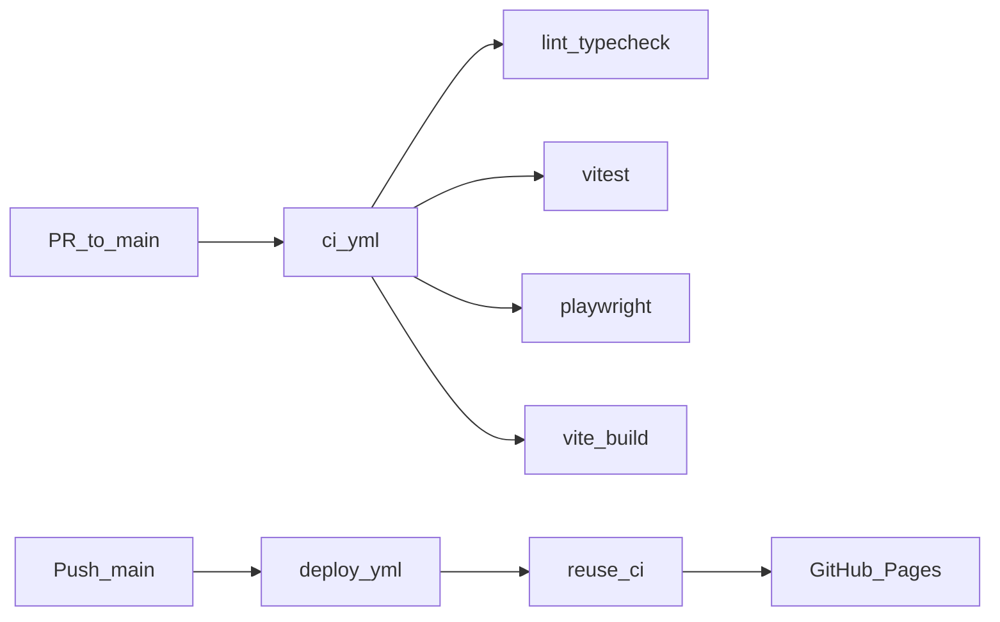

# Engineering — Daily Hold

Local development and GitHub Actions for the web PWA stack.

## Stack

| Layer | Choice |
|-------|--------|
| Language | TypeScript |
| Bundler | Vite 6 |
| Game runtime | Phaser 3 |
| Unit tests | Vitest |
| E2E | Playwright (Chromium) |
| Hosting | GitHub Pages (`/towerdefense/` base) |
| Stores (later) | Capacitor wrap — not in MVP |

## Local commands

```bash
npm install
npm run dev          # http://localhost:5173/towerdefense/
npm run test         # Vitest unit suite
npm run test:coverage
npm run test:e2e     # Playwright smoke (starts preview)
npm run lint
npm run typecheck
npm run build        # dist/
npm run preview      # prod-parity local server
```

Node **22+** required. No Docker for MVP.

## Layout

```
src/game/daily/      seed + attempt gate (T5/T6)
src/game/systems/    economy, lives, ads policy (G1/T7)
src/game/share/      spoiler-free share card (T8)
src/game/scenes/     Phaser Boot + Home scaffold
tests/unit/          Vitest
tests/e2e/           Playwright smoke
.github/workflows/   ci.yml + deploy.yml
```

## CI / CD



- **CI** (`.github/workflows/ci.yml`): on PR/push to `main` — lint, typecheck, unit+coverage, build, e2e.
- **Deploy** (`.github/workflows/deploy.yml`): on push to `main` — runs CI via `workflow_call`, then publishes `dist/` to Pages.
- **Never deploy a red build** — deploy job `needs: quality`.

### One-time GitHub settings

1. Repo → **Settings → Pages** → Source: **GitHub Actions**
2. (Recommended) Branch protection on `main`: require `CI` / quality job to pass

## Automated checks ↔ metrics

| Automated check | Metric / gate |
|-----------------|---------------|
| `dailySeed` / `buildSpawnSchedule` determinism | T5 / G2 |
| Official attempt 1–3 then Practice | T6 / G2 |
| Spend/leak rules | G1 |
| `canShowAd` blocks mid-wave | T7 |
| Share payload fields, no spoiler keys | T8 |
| E2E home shell + canvas, no page errors | T4 smoke |

Manual playtest metrics (P1–P12) remain in [testing-and-metrics.md](./testing-and-metrics.md).

## Ads env

```bash
VITE_ADS_MODE=test   # default for Pages / local
VITE_ADS_MODE=off    # disable ad policy paths in UI later
```
