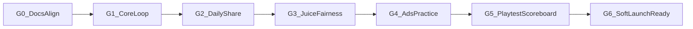

# Testing & Delivery Metrics — Daily Hold

Guidelines for building interactively against the locked product plan (Daily Dare TD + near-miss + Editorial Soft Defense). Use this doc as the **definition of done**, the **regression checklist**, and the **scoreboard** whenever behavior or UX changes.

Related: [viral-game-plan.md](./viral-game-plan.md) · [engineering.md](./engineering.md) · [gate-status.md](./gate-status.md) · GDD when authored.

---

## 1. North-star goals

Every change should move us toward (or at least not harm) these outcomes:

| Goal | Plain-language success |
|------|------------------------|
| **Instant comprehension** | A new player places a tower and starts a wave without a tutorial wall |
| **Just one more** | Players use attempts 2–3 without being prompted |
| **Fair failure** | After a leak, players can say *why* it happened |
| **Shareable ritual** | Players copy/share the result card without being nagged hard |
| **Daily return** | Players come back because it is *today’s* dare |
| **Readable battlefield** | Tower roles and path danger are obvious at a glance |
| **Honest monetization** | Today’s Dare stays free; ads never break focus mid-wave |

If a change helps one goal but clearly breaks another (e.g. longer sessions that kill retry rate), treat it as a failed experiment unless metrics prove otherwise.

---

## 2. Metric catalog (track, compare, gate)

Record a **baseline** whenever a milestone ships or a playtest runs. After each meaningful change, re-measure the affected metrics and note delta in the change log (section 7).

### 2.1 Product / playtest metrics

| ID | Metric | How to measure | Healthy target (early) | Kill / pivot signal |
|----|--------|----------------|------------------------|---------------------|
| P1 | **Time to first place** | Stopwatch / event: app open → first tower placed | ≤ 20s median | > 45s or “what do I do?” |
| P2 | **Time to first Start Wave** | Open → Start Wave | ≤ 45s median | > 90s |
| P3 | **Tutorial independence** | % completing attempt 1 with only the one-line tip | ≥ 80% | < 50% |
| P4 | **Attempt 2+ rate** | % of sessions that start attempt 2 or 3 same day | ≥ 60% | < 30% |
| P5 | **Session length (official attempt)** | Start attempt → result screen | Median 2–5 min | Median > 8 min or < 60s |
| P6 | **Fairness comprehension** | Post-fail: player correctly names leak cause | ≥ 80% | “felt random” > 20% |
| P7 | **Near-miss notice** | Unaided recall of near-miss headline / pulse | ≥ 50% | 0 unaided mentions |
| P8 | **Unprompted share / copy** | Share or copy without soft-nudge only | ≥ 1 in 5 playtesters | 0 across 10 testers |
| P9 | **Prompted share rate** | Share after result CTA | ≥ 40% in test | < 10% |
| P10 | **D1 return intent** | “Would you open tomorrow for today’s dare?” | ≥ 70% yes | < 40% |
| P11 | **Role readability** | Name each tower’s job without tooltips | ≥ 80% correct | Confuses 2+ towers |
| P12 | **Seed fairness belief** | “Same challenge for everyone today?” understood | ≥ 90% | Confusion about RNG |

### 2.2 Technical / delivery metrics

| ID | Metric | How to measure | Target | Fail |
|----|--------|----------------|--------|------|
| T1 | **Cold load to interactive** | Lighthouse / stopwatch on mid phone / throttled 4G | ≤ 3s to home interactive | > 5s |
| T2 | **Gameplay FPS** | Chrome perf / in-game counter mid-wave | ≥ 55 FPS median | < 30 sustained |
| T3 | **Input latency** | Tap place → tower appears | Feels instant; ≤ 100ms | Noticeable lag |
| T4 | **Crash / exception rate** | Console + error boundary | 0 on happy paths | Any crash on core loop |
| T5 | **Determinism** | Same seed + same actions → same wave spawns | 100% match | Any drift |
| T6 | **Attempt gate correctness** | 4th official start redirects to Practice | Always | Can soft-lock or cheat count |
| T7 | **Ad safety** | No interstitial mid-wave; banners off during combat | 100% | Any mid-wave interrupt |
| T8 | **Share card integrity** | Card has date, score, attempts, near-miss; no layout spoilers | Always | Spoilers or missing fields |

### 2.3 Business / habit metrics (post soft-launch)

| ID | Metric | Target (directional) | Notes |
|----|--------|----------------------|-------|
| B1 | D1 retention | Climb toward 30%+ | Habit games; early soft-launch varies |
| B2 | D7 retention | Climb toward 10%+ | Watch before heavy UA |
| B3 | Official attempts / DAU | ~1.5–2.5 | Below 1 = weak hook |
| B4 | Practice attach rate | Rising with clarity of value | Fuel for rewarded ads |
| B5 | Rewarded opt-in | Rising when offer is clear | Never paywall fairness |
| B6 | Share → install (if tracked) | Any organic loop | Validate viral spine |

Do not optimize B-metrics until P-metrics and T-metrics are green on the core loop.

---

## 3. Delivery gates (build in order; do not skip)

Use these as interactive build checkpoints. **Do not start the next gate until the current gate’s must-pass checks are green.**



### G0 — Docs aligned

**Must pass**

- [ ] Product target locked: Daily Dare TD + near-miss + Editorial Soft Defense
- [ ] This metrics doc linked from README
- [ ] Open questions list empty for MVP scope (or explicitly deferred to Phase 2)

**Exit:** Ready to scaffold code.

### G1 — Core loop functional

Playable: map → place/upgrade/sell → waves → lives/gold → win/lose result.

**Must pass (automated + manual)**

- [ ] T4: no crash on place / start / leak / clear
- [ ] T2: FPS target on reference device/browser
- [ ] P1–P2 smoke: developer can hit targets themselves
- [ ] Enemies follow path; leak decrements lives; 0 lives → result
- [ ] Gold economy cannot go negative from legal actions
- [ ] Visual palette tokens present (even if geometric placeholders)

**Must-pass tests to add in repo when code exists**

- Unit: path following, collision/leak detection, gold spend/refund rules
- Integration: one full wave clear; one forced leak → result state

**Exit:** Loop is fun enough to iterate balance; no daily/share yet required.

### G2 — Daily seed + attempts + share card

**Must pass**

- [ ] T5: fixed seed replay produces identical spawn schedule
- [ ] T6: exactly 3 official attempts; further runs are Practice
- [ ] UTC date drives seed; date label matches card
- [ ] T8: share card fields complete; no tower-layout screenshot
- [ ] Result → Share / Retry / Home all work
- [ ] P12 smoke: copy explains “same dare for everyone”

**Exit:** Ritual spine exists; ready for juice.

### G3 — Near-miss + fairness juice

**Must pass**

- [ ] Closest-leak % (or equivalent) computed and shown on result
- [ ] Near-miss motion fires in last ~10% of path (P7 instrumentable)
- [ ] Fail reason string names enemy type + context (P6)
- [ ] No RNG loot in official daily (fairness rule)

**Exit:** Emotional loop present before monetization.

### G4 — Practice + ads (test IDs)

**Must pass**

- [ ] T7: zero mid-wave interstitials; banners disabled in combat
- [ ] Interstitial only after attempt end; rate cap respected
- [ ] Rewarded paths only in Practice / optional tips
- [ ] Today’s Dare never locked behind ad or IAP
- [ ] Remove-ads flag (even stub) disables ad calls

**Exit:** Monetization cannot violate product principles.

### G5 — Playtest scoreboard (5–10 people)

Run the script in section 5. Fill the scoreboard table. Compare to targets in section 2.1.

**Must pass to call MVP “validated”**

- [ ] P3 ≥ 80% or documented UX fix queued immediately
- [ ] P4 ≥ 60%
- [ ] P5 median in 2–5 min
- [ ] P6 ≥ 80%
- [ ] P8 or P9 shows real share behavior
- [ ] P11 ≥ 80%
- [ ] No T4 crashes during sessions

**Exit:** Either soft-launch candidate or explicit iterate list tied to failed metrics.

### G6 — Soft-launch ready

- [ ] Analytics events for P/T/B metrics wired (section 6)
- [ ] Error reporting on
- [ ] Balance version stamped on attempts
- [ ] Privacy/consent stub for ads where required

---

## 4. Exhaustive test matrix

### 4.1 Functional — core systems

| Area | Cases |
|------|--------|
| **Placement** | Place on buildable; reject path tiles; reject occupied; max towers if capped; cancel placement |
| **Upgrade / sell** | Afford upgrade; block if cannot afford; sell refund rule; select/deselect |
| **Waves** | Start; spawn order by seed; between-wave build phase; final wave clear |
| **Combat** | Targeting rules per tower; range; projectile/hit; kill credit gold |
| **Lives** | Leak −1; multi-leak same frame; death at 0; win with 1 life left |
| **Near-miss** | Enemy enters last 10%; dies in last 10%; escapes; headline picks closest |
| **Daily** | Seed from date; midnight UTC rollover; attempt counter reset; Practice unlimited |
| **Share** | Generate image; copy text fallback; no spoilers; landscape/portrait |
| **Navigation** | Home ↔ play ↔ result; retry; practice entry from 4th attempt |
| **Ads** | Banner home/post; interstitial post-attempt; none mid-wave; rewarded practice |

### 4.2 Determinism & fairness

| Case | Expect |
|------|--------|
| Same date seed on two clients | Identical wave script |
| Same seed, identical placements/timings | Identical outcomes (within engine float policy) |
| Different dates | Different scripts |
| Balance version bump | Old receipts keep old version id (when backend exists) |
| No hidden RNG in daily loot | Verified by code review + test |

### 4.3 Device / UX

| Case | Expect |
|------|--------|
| iPhone SE-class width | Full loop usable; no clipped CTA |
| Large phone / desktop | Composition holds; no sparse “empty dashboard” home |
| Touch + mouse | Place/select works |
| Slow 4G | T1 still met or clear loading state |
| Reduced motion (if respected) | Near-miss still understandable via text |
| Light mode shell | Share card matches editorial direction |

### 4.4 Regression pack (run on every gameplay change)

Minimum smoke before merge:

1. Fresh load → place → start wave → kill something → leak once → see result headline  
2. Complete or fail → share card fields present  
3. Burn 3 attempts → 4th is Practice  
4. No console errors; FPS still acceptable mid-wave  
5. Confirm no ad call during active wave  

Document results in the change log (section 7).

### 4.5 Alignment audit (plan conformance)

On each milestone, re-check:

| Plan rule | Check |
|-----------|--------|
| Short classic session, not hypercasual 30s | P5 |
| Daily shared seed | T5 + date UI |
| Near-miss juice | Result + motion |
| Spoiler-free share | T8 |
| Editorial Soft Defense palette/type | Visual review vs tokens |
| Today free; ads not mid-wave | T7 |
| 3–4 towers, 2 upgrade tiers | Content count |
| No accounts required for day-one | G1–G5 flows |

Any intentional deviation needs a written note in the change log and an updated target metric.

---

## 5. Playtest script (G5)

**Setup:** 5–10 people; mix of TD fans and non-fans; no coaching beyond the in-game one-line tip.

**Protocol (per tester, ~15–20 min)**

1. Hand device/URL; observe silently for attempt 1 (record P1, P2, P3).  
2. Allow attempts 2–3 naturally (P4, P5).  
3. Ask: “Why did you fail/succeed?” (P6).  
4. Ask: “Did anything almost leak?” (P7).  
5. Point to share only if they have not shared (P8 then P9).  
6. “Point to the slow tower / AoE tower” (P11).  
7. “Is today’s challenge the same for everyone?” (P12).  
8. “Would you open tomorrow?” (P10).  

**Scoreboard template**

| Tester | P1s | P2s | P3 | Att2+ | SessMin | Fair? | NearMiss? | Share | RolesOK | D1intent | Notes |
|--------|-----|-----|----|-------|---------|-------|-----------|-------|---------|----------|-------|
| 1 | | | | | | | | | | | |

Store completed scoreboards under `docs/playtests/YYYY-MM-DD.md` when runs happen.

---

## 6. Analytics event contract (implement with code)

Emit at least:

| Event | Key props |
|-------|-----------|
| `session_start` | `client_ts`, `app_version` |
| `tower_placed` | `tower_type`, `tile`, `elapsed_ms` |
| `wave_started` | `wave_index`, `seed`, `mode=daily\|practice` |
| `enemy_near_miss` | `path_pct_remaining`, `enemy_type` |
| `life_lost` | `enemy_type`, `path_pct`, `lives_left` |
| `attempt_end` | `result`, `score`, `closest_leak_pct`, `duration_ms`, `attempt_n` |
| `share_click` | `surface=result`, `method=native\|copy` |
| `ad_impression` | `format`, `placement` |
| `ad_blocked_by_policy` | `reason=mid_wave` (debug) |

Use these to recompute section 2 metrics without relying only on memory.

---

## 7. Change log protocol (compare whenever we change things)

For every PR / interactive build slice that touches gameplay, economy, UX, ads, or visuals:

```markdown
### YYYY-MM-DD — short title
- Goal touched: (P/T/B ids)
- Change:
- Regression pack: PASS/FAIL (notes)
- Metrics before → after:
  - P4: 55% → 68%
  - P5 median: 6:10 → 3:40
- Alignment audit: PASS / DEVIATion (why)
- Next action:
```

Keep running entries in `docs/change-log.md`.

**Rule:** If a change cannot name which metric IDs it should improve (or protect), it is out of scope for that slice.

---

## 8. CI automation checklist

GitHub Actions ([`ci.yml`](../.github/workflows/ci.yml)) must stay green on every PR. Mapping to technical metrics:

| CI step | Protects |
|---------|----------|
| `npm run lint` / `typecheck` | T4 (crash/exception hygiene) |
| Vitest: seed + spawn determinism | T5 |
| Vitest: attempt gate 1–3 → Practice | T6 |
| Vitest: `canShowAd` mid-wave block | T7 |
| Vitest: share payload / no spoiler keys | T8 |
| Vitest: economy / lives | G1 foundations |
| Playwright home smoke | T1/T4 smoke; shell loads |
| `npm run build` | Deployability |

Deploy ([`deploy.yml`](../.github/workflows/deploy.yml)) only runs after CI succeeds. Local parity: see [engineering.md](./engineering.md).

## 9. Interactive build loop (how we use this day to day)

1. Pick the **lowest unfinished gate** (G0→G6).  
2. Implement the smallest slice that can move a must-pass check.  
3. Run **regression pack** (4.4) + any new automated tests.  
4. Update **change log** with metric IDs.  
5. Only then advance the gate checklist.  
6. At G5, freeze features and run the playtest script before new content.

This keeps build work tethered to the plan: functional, measurable, and comparable across iterations.
