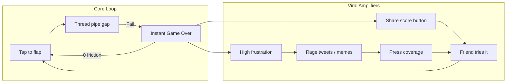
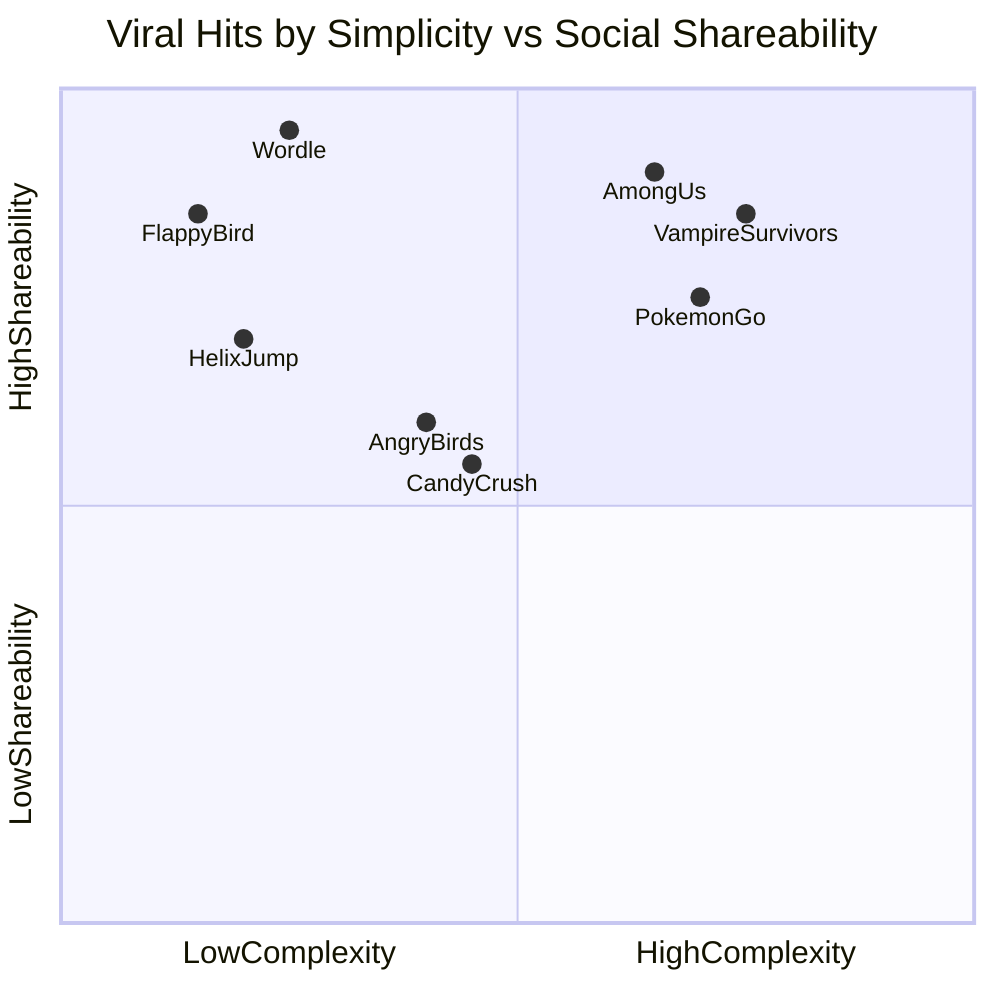
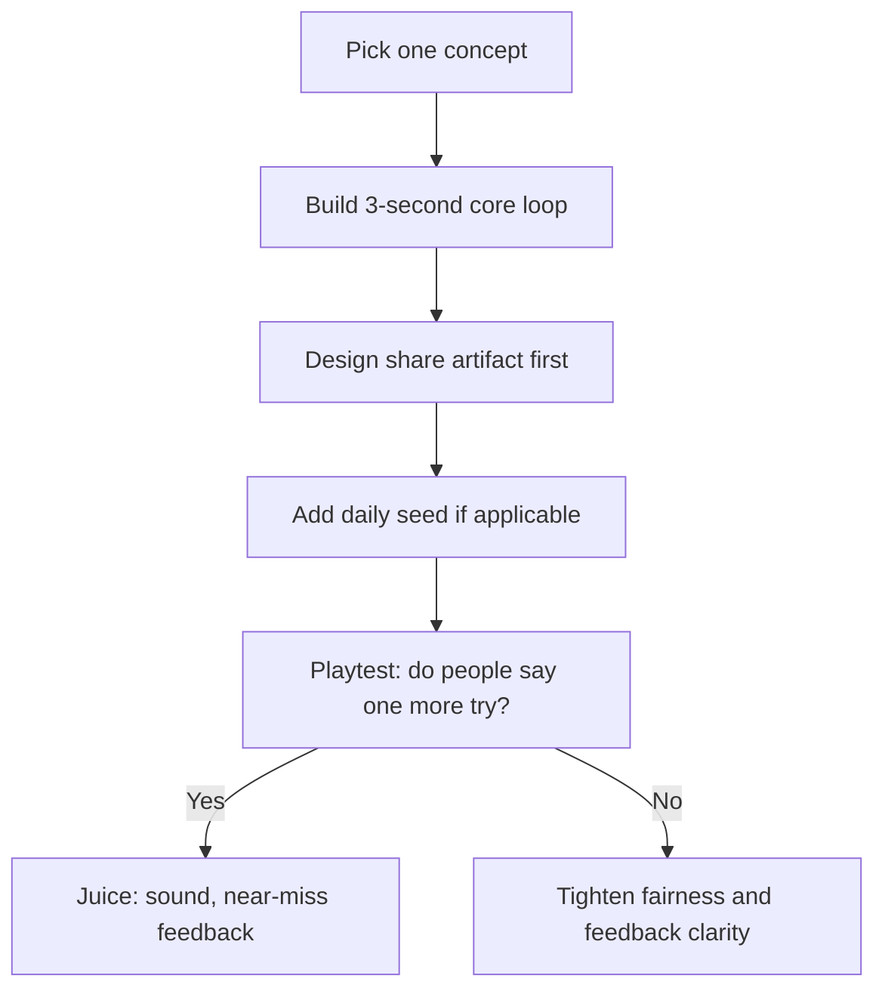

# Viral Game Pattern Analysis & Brainstorm

**Overview:** Comparative analysis of why Flappy Bird exploded in 2014, how it maps to other viral game hits, the design patterns they share, and concrete new game concepts built on those commonalities.

**Workspace note:** Captured from a no-repo planning chat into this repo (`towerdefense`) as design research. **Product lock:** Daily Dare TD hybrid (Idea B spine + Idea A near-miss) as **Daily Hold** — see [`product-target.md`](./product-target.md). Build/test gates live in [`testing-and-metrics.md`](./testing-and-metrics.md).

## What Made Flappy Bird a Craze

Flappy Bird (Dong Nguyen, May 2013) sat obscure for ~8 months before topping charts in January 2014 — a slow burn, then a feedback loop. It was not a marketing campaign; it was **organic virality + psychological hook + cultural moment**.

### Flappy Bird's Specific Success Factors

| Factor | How Flappy Bird Did It |
|--------|------------------------|
| **Zero tutorial** | One input: tap. Anyone can play in 3 seconds. |
| **Brutal but fair difficulty** | Death is always your fault (hit pipe / ground). Clear cause → instant retry. |
| **Micro-sessions** | Runs last seconds, not minutes. "One more try" costs almost nothing. |
| **Near-miss economy** | Almost clearing a pipe feels like progress, not failure — strongest trigger for "just one more." |
| **Emotional sharing fuel** | Scores of 2–20 are both humiliating and funny; rage becomes content. |
| **Built-in share prompt** | Game Over screen: Share vs Replay. Low scores shared ironically; high scores shared proudly. |
| **No paywall friction** | Free, no IAP — only banner ads. Zero barrier to "try it because everyone is talking about it." |
| **Retro / "broken" aesthetic** | NES-era Mario pipes + crude art made it feel accidental, meme-able, and anti-corporate. |
| **Accidental social game** | No official community — Twitter *was* the community. Shared suffering created belonging. |
| **Luck + timing** | Long dormant period in AU charts; US Twitter trend Jan 22, 2014; media amplified an already-climbing app. |

Key insight: chart climb **preceded** the #flapflap hashtag spike — sharing amplified momentum; word-of-mouth started the snowball.

---

## Comparative Matrix: Flappy Bird vs Other Major Hits

| Game | Era | Core Hook | Session Length | Social Mechanism | Why It Spread |
|------|-----|-----------|----------------|------------------|---------------|
| **Flappy Bird** | 2014 | One-tap precision | 5–30 sec | Rage tweets, score share | Shared frustration + meme aesthetic |
| **Angry Birds** | 2010 | Physics puzzle | 1–3 min | "Look at this shot" clips | Satisfying destruction spectacle; App Store early wave |
| **Candy Crush** | 2012 | Match-3 + lives | 2–5 min | Facebook invite spam (early) | Near-miss level design; "almost beat it" loop |
| **2048** | 2014 | Slide + merge | 3–10 min | Screenshot high score | Pure score bragging; zero install (web) |
| **Wordle** | 2021 | One puzzle/day | 3–5 min | Spoiler-free emoji grid share | Daily ritual + status without spoiling |
| **Among Us** | 2020 spike | Social deduction | 10–20 min | Streamer clips, accusations | "Watch this" loop; COVID + Discord timing |
| **Pokemon Go** | 2016 | AR collection | 15–60 min | "I found one here" IRL posts | Real-world novelty + nostalgia IP |
| **Helix Jump** | 2018 | Timing descent | 10–30 sec | Satisfying bounce clips | Same micro-loop as Flappy; polished hyper-casual |
| **Vampire Survivors** | 2022 | Auto-attack roguelike | 20–30 min | "This build is broken" clips | Emergent chaos; streamer-friendly systems |

---

## 7 Common Patterns Across Viral Hits

### 1. Instant Comprehension (3-Second Rule)
No manual. The first interaction teaches everything. Flappy Bird, Helix Jump, Wordle, 2048 all pass the "hand phone to friend" test.

### 2. The "Just One More" Loop
Short feedback cycles with **cheap failure** (instant restart) and **expensive-feeling success** (high skill ceiling). Near-misses spike dopamine harder than clean losses — Flappy's pipe edge and Candy Crush's "1 move left" use the same psychology.

### 3. Emotion Worth Broadcasting
Players share when they feel: rage, pride, absurdity, or schadenfreude. Flappy's score-of-2 shares and Among Us accusations are different emotions, same outcome — **content creation**.

### 4. Shareable Artifact, Not Just "Share Button"
Wordle's emoji grid works because it communicates status without spoiling. Flappy's "OMG I scored 5 pts" works because low scores are comedy. A generic "I played!" button rarely spreads.

### 5. Perceived Fairness
Death/failure must feel earned, not random. Flappy Bird's controversy was about *difficulty*, not *unfairness* — players knew exactly why they died.

### 6. Low Adoption Cost
Free or near-free entry, minimal time to first fun, works on hardware people already have. Wordle was a URL; Flappy was a free download.

### 7. Context Activation (Often Luck)
Among Us had virality patterns for 2 years before COVID + streamers activated them. Flappy needed Twitter trending + press. **Great design can lie dormant until the right distribution channel appears.**

---

## What Flappy Bird Did *Differently* (Not Universal)

- **No progression system** — most sustained hits (Candy Crush, Pokemon Go) layer retention mechanics Flappy lacked.
- **No daily hook** — Wordle's one-puzzle-per-day created appointment viewing; Flappy was pure binge.
- **Anti-polish as brand** — retro ugliness was part of the meme; Helix Jump proved the same loop works with polish.
- **Creator removed it** — scarcity after takedown became its own legend; not a replicable strategy.

---

## Brainstorm: New Game Ideas Built on Common Patterns

Each concept intentionally combines **instant comprehension + just-one-more + shareable emotion**.

### Idea A: "Almost" — The Near-Miss Game
- **Loop:** One-button timing game where the score is *how close* you got to the obstacle, not whether you cleared it.
- **Share:** Auto-generates a clip/GIF of your closest brush (0.03s from death) — the spectacle IS the share.
- **Pattern stack:** Micro-session + near-miss economy + failure spectacle

### Idea B: "Daily Dare" — Wordle Meets Flappy
- **Loop:** One identical challenge per day for all players (same pipe sequence / seed). One attempt, or 3 attempts with best score counting.
- **Share:** Spoiler-free score card: `🟢🟢🔴 (2/3)` style.
- **Pattern stack:** Daily ritual + low score comedy + fair shared challenge

### Idea C: "Reverse Flappy" — You Are the Obstacle
- **Loop:** Two players async: one flaps, one places pipes in real-time replay. Swap roles daily.
- **Share:** "I killed 47 birds today" vs "I survived 12 pipes."
- **Pattern stack:** Social asymmetry + schadenfreude + micro-sessions

### Idea D: "Rage Relay" — Accidental Social Game 2.0
- **Loop:** Pass-the-phone hot potato: each person gets one tap to keep a shared run alive. Group score = taps survived.
- **Share:** Group score + who died (named shame).
- **Pattern stack:** Zero tutorial + shared frustration + IRL social (party game)

### Idea E: "One Pixel" — Ultra-Minimal Stream Bait
- **Loop:** Entire game is one pixel moving; audio/visual feedback carries all information. Deliberately weird aesthetic for clip culture.
- **Share:** Built for 15-second TikTok "what is this" reactions.
- **Pattern stack:** Instant comprehension + visual contrast + watch-this loop

### Idea F: "Skill Floor, Meme Ceiling"
- **Loop:** Game is trivially easy for 30 seconds, then introduces one absurd mechanic (gravity reverses, bird grows, pipes spin). High scores are inherently funny.
- **Share:** "I died because the bird sneezed" — procedural failure stories.
- **Pattern stack:** Fair early + emergent chaos + narrative sharing

---

## Recommended Next Step (If You Want to Build)

Highest-leverage starting points: **Idea B (Daily Dare)** or **Idea A (Almost)** because they:
- Require minimal art/assets (Flappy-like scope)
- Encode the strongest cross-hit patterns (daily hook + near-miss + share artifact)
- Are testable as a web/mobile MVP in a single session
- Don't depend on multiplayer infrastructure or IP

### Suggested todos
1. Choose which brainstormed concept (A–F) to prototype, or hybridize patterns
2. Design the shareable output first (emoji grid, GIF, score card) before core mechanics
3. Implement 3-second comprehensible one-input loop with instant restart
4. Add close-call visual/audio feedback to maximize just-one-more retention
5. Test with 5+ people: measure retry rate and unprompted sharing behavior

## Sources
- https://www.gamedeveloper.com/business/what-is-flappy-bird-and-how-did-it-get-to-be-1-
- https://www.wired.com/story/flappy-bird/
- https://www.killscreen.com/flappy-bird-and-rise-accidental-social-game/
- https://thewildforeststudio.com/articles/article-1.html
- Near-miss psychology research (Candy Crush / gambling parallels)
